# Photobomb HTB

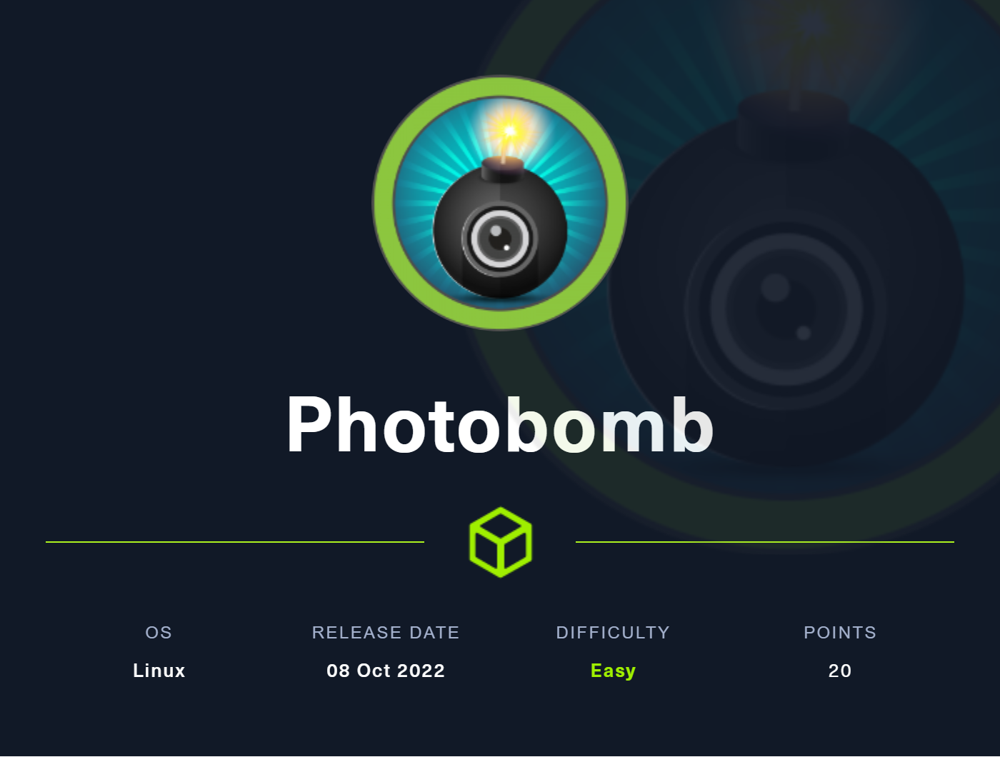

## Enumeration

### NMAP

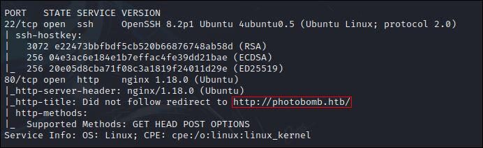

2 services présents:
- SSH sur le port 22
- HTTP sur le port 80

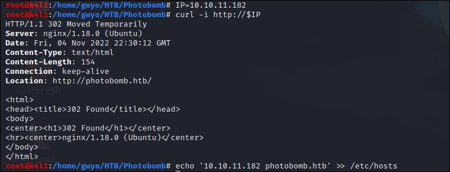

Ajoutons **photobomb.htb** à notre */etc/hosts*.

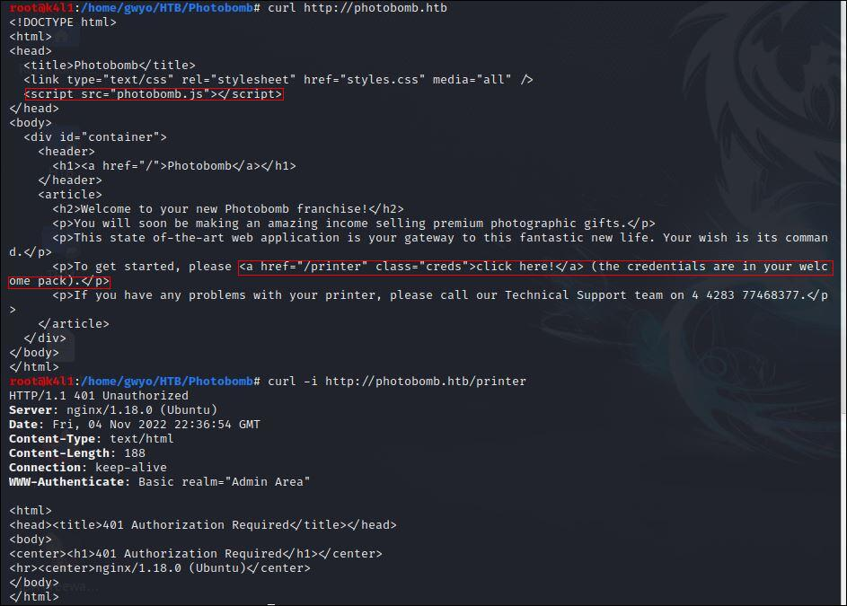

Nous avons une page **/printer** qui demande d'être authentifié et un fichier javascript **photobomb.js**.

Voyons ce script !

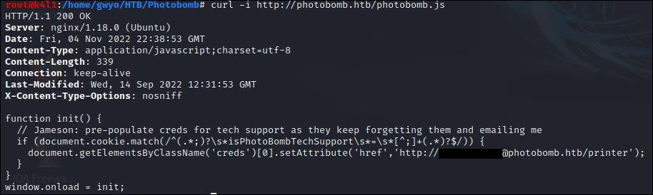

Nous trouvons les identifiants pour nous connecter sur la page **/printer**

## EXPLOITATION

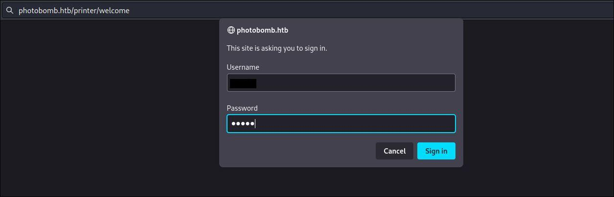

On se retrouve sur une application de distribution d'images.

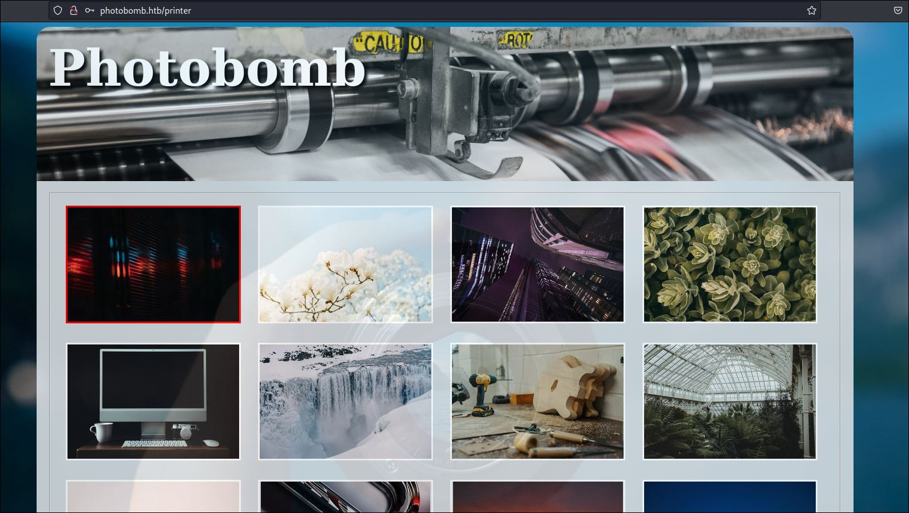

Avec un formulaire qui génère des images dans différents formats.

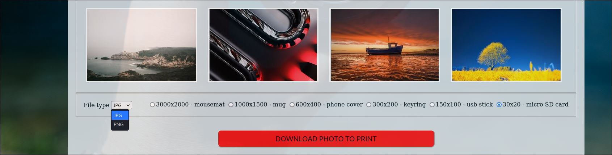

### REMOTE COMMAND EXECUTION (RCE)

Après examen de la requête, il est possible d'injecter des commandes dans le paramètre **filetype**...

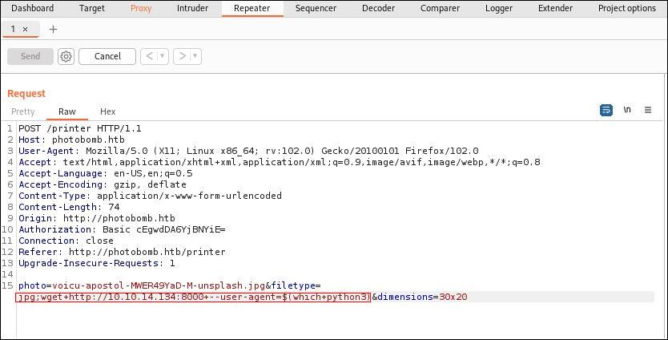

Puisque **wget** est présent sur la machine cible, nous pouvons utiliser le **User-Agent** pour exfiltrer des données et trouver un programme qui pourrait nous permettre de lancer un *reverse shell*.

Sur ce sujet, je conseille cette [vidéo sur la construction de reverse shells](https://www.youtube.com/watch?v=5EA3HUYzi8k).

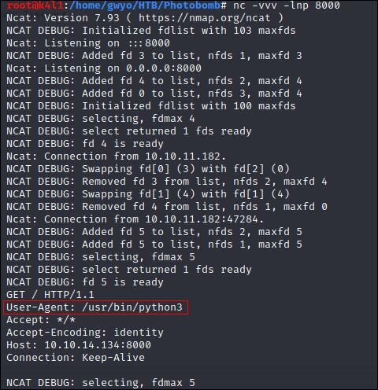

Et construire notre payload.

[UNIX Reverse Shells Cheatsheet](https://podalirius.net/fr/articles/unix-reverse-shells-cheatsheet/)

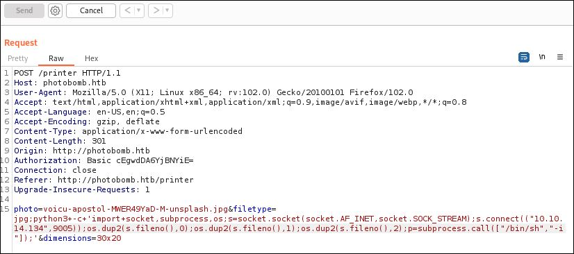

Un reverse shell en python3 nous donne un point d'entrée sur la machine, et un shell utilisateur authentifié en tant que **wizard**.

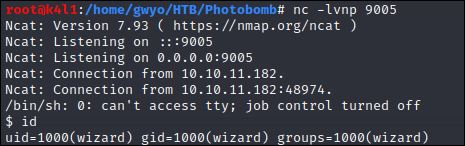

On se met à l'aise avec un pseudo-terminal interactif en bash à partir du processus courant, et ajusté à notre fenêtre de terminal.

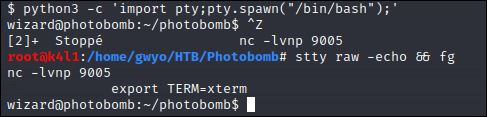

Commençons par regarder les droits **sudo**.

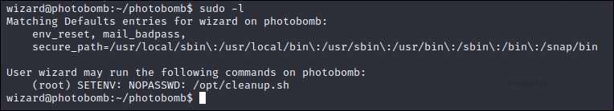

Ah, ce n'est pas banal...

## PRIVILEGE ESCALATION

L'utilisateur **wizard** a donc le droit d'exécution  sur un script shell dans */opt* en tant que **root**.

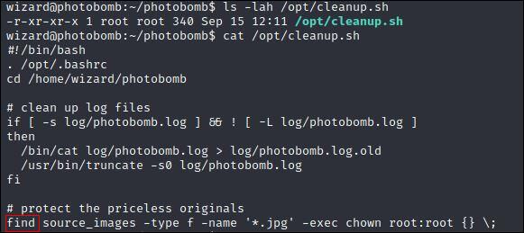

A la fin du fichier, on peut voir que le chemin absolu n'est pas spécifié dans l'appel au binaire **find**.
Si, au moment de l'exécution , on arrivait à usurper cet appel pour exécuter bash à la place, nous serions **root**.

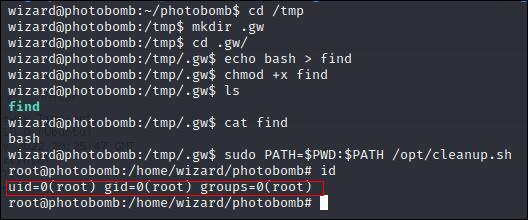

En réécrivant la variable d'environnement **PATH** dans le contexte de l'exécution de la commande, on parvient à lancer notre propre **find** dans le répertoire courant, qui va exécuter le binaire **bash** à la place.

Merci à [slartibartfast](https://app.hackthebox.com/users/85231) pour cette Box Easy.

N'hésitez pas à aller lui donner du "respect" sur son profil si elle vous a plu.

### Liens: 
- [Comment construire des reverse shells - Rémi Gascou (@Podalirius )](https://www.youtube.com/watch?v=5EA3HUYzi8k)
- [UNIX Reverse Shells Cheatsheet](https://podalirius.net/fr/articles/unix-reverse-shells-cheatsheet/)
- [Profil HackTheBox de slartibartfast](https://app.hackthebox.com/users/85231)

